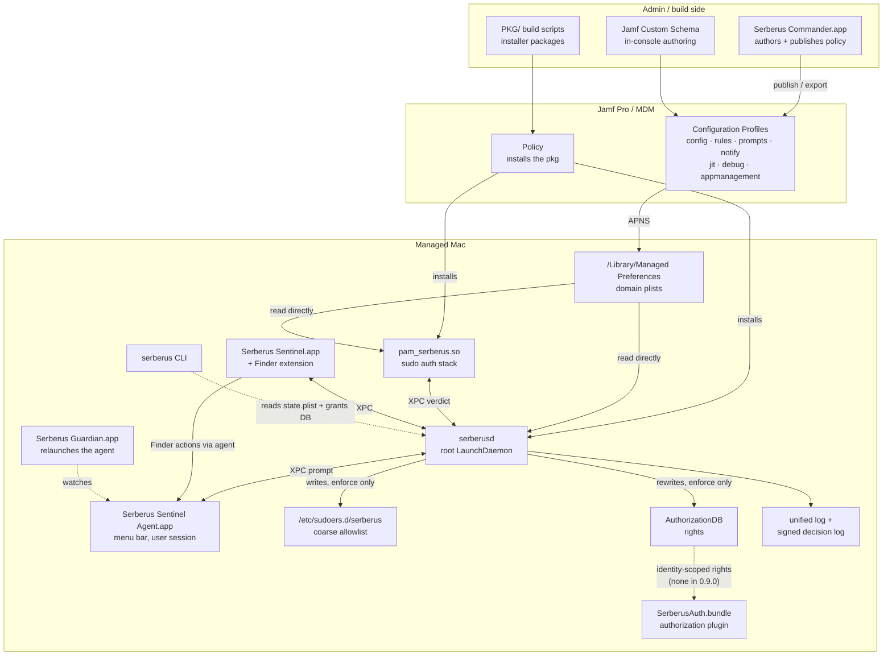
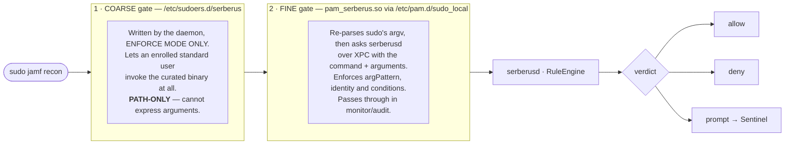
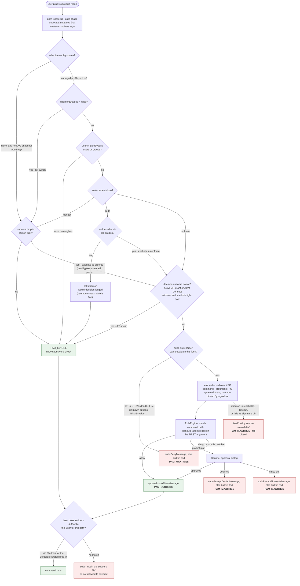
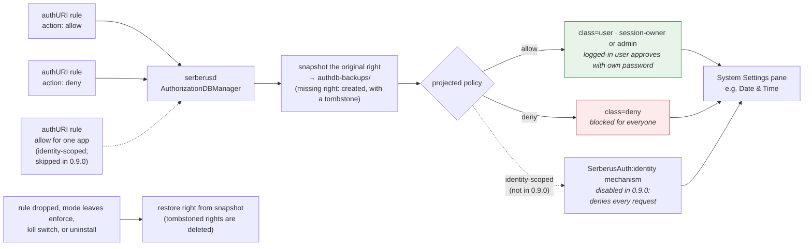
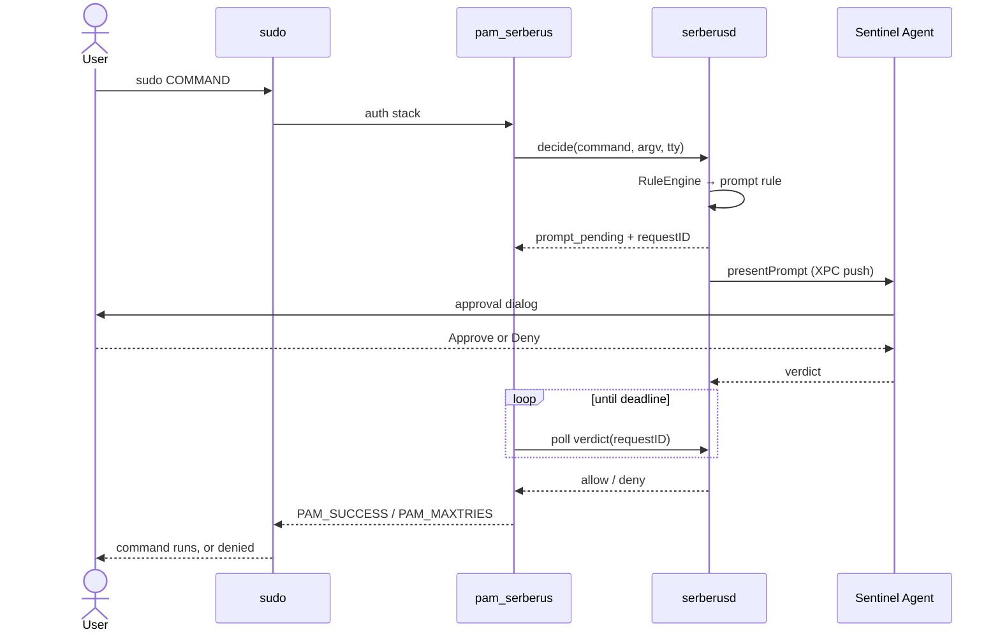
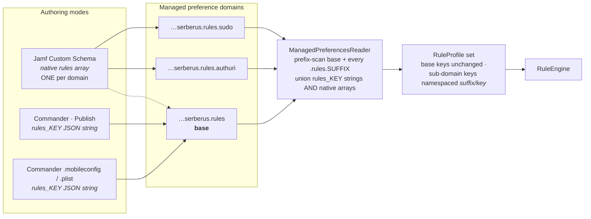
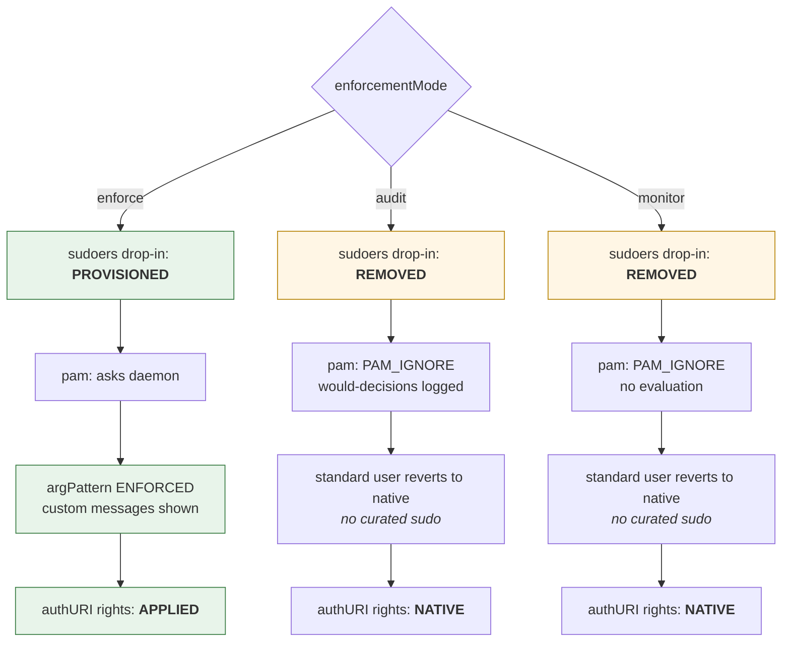
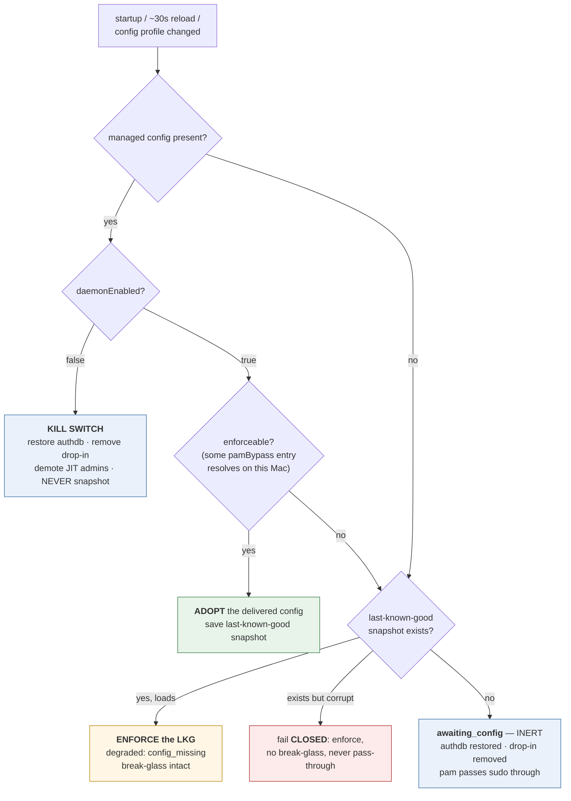
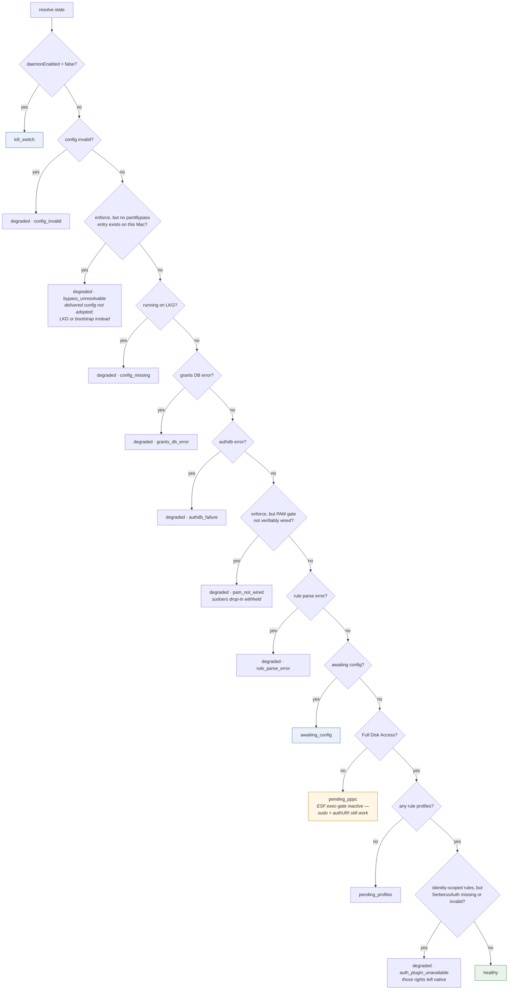
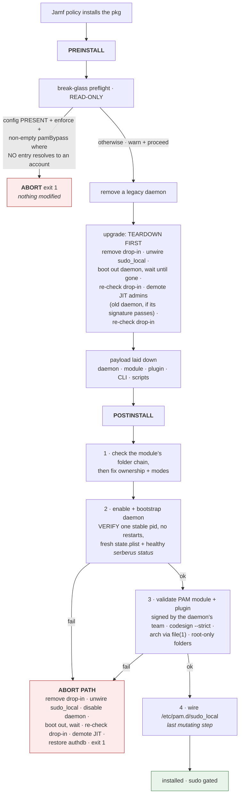

# Serberus — System Overview

_macOS 26 · reverse-DNS prefix `com.herojoneslabs.serberus`._

---

## 1. What Serberus is

Serberus is a **macOS privilege-management system** for MDM-managed (Jamf) fleets. Instead of making a user a local admin, it grants **specific, policy-driven, audited elevation**. A standard (non-admin) user can be allowed to run only specific `sudo` commands, use only specific authorization rights (such as a System Settings pane), and request time-limited admin. Policy is delivered by configuration profiles. A signed root daemon and a PAM module enforce it on the Mac.

It is installed with packages (see [PKG/README.md](../PKG/README.md)) and configured entirely through **managed preference domains** (configuration profiles). The end user installs and configures nothing.

### The problem it solves
- **Standing local admin is a security risk.** Serberus grants the *specific* things users need (for example `sudo jamf recon`, or changing the time zone) without full admin.
- **Native macOS authorization is coarse.** Serberus sits in the `sudo` PAM stack and rewrites the macOS AuthorizationDB, so it can decide per command, per argument, and per right.
- **Everything is logged** to the unified log (`subsystem == com.herojoneslabs.serberus`) and to a signed decision log.

---

## 2. What it does (capabilities)

| Capability | Description |
|---|---|
| **Curated standard-user sudo** | An *enrolled* standard user can run only the `sudo` commands that policy allows, matched by command path **and** first argument (for example `jamf recon` but not `jamf policy`). |
| **AuthorizationDB (authURI) rules** | Rewrites macOS authorization rights so the logged-in user can approve specific actions with their own password (for example Date & Time), or so a right is denied outright. Identity-scoped (per-app) rules are disabled in 0.9.0 because the app's identity can be forged; see [authuri-identity-scoped-rules.md](authuri-identity-scoped-rules.md#disabled-in-090). |
| **Prompt-based approval** | A rule can require approval. The Sentinel menu-bar agent shows a dialog, and the daemon holds the `sudo` request until the user answers or the prompt times out. |
| **Just-in-time (JIT) local admin** | A user can request time-limited admin (provider `serberus`, which uses the local `admin` group, or `jamf_connect`, which hands off to Jamf Connect or Self Service+). Serberus demotes the user when the time runs out and never demotes an admin it did not promote. While elevated, the user gets native `sudo`. The `jamf_connect` provider is experimental: run end to end once, with Self Service+ and its bundled Jamf Connect on macOS 26.7. |
| **Install/Uninstall with Serberus** | Optional Finder actions that let a standard user install notarized software from allowed publishers, or move an app in `/Applications` to their Trash. Off unless a profile turns them on. Experimental: Install has been run end to end under the real root daemon on one test Mac only (macOS 26.7). |
| **Custom user-facing messages** | Optional messages shown in the terminal when `sudo` is denied, allowed, declined at the prompt, or times out. Each can use a `{command}` token. |
| **Enforcement modes** | `enforce` (full policy), `audit` (evaluate and log, change nothing), `monitor` (observe only, change nothing). |
| **Break-glass and fail-safe** | Listed bypass users and groups always reach native `sudo`. In `enforce` mode, `sudo` fails closed when the daemon can't answer. An AuthorizationDB write that fails doesn't stop the rest of the policy: denies are written first, and the daemon reports `degraded (authdb_failure)` and retries every 30 seconds. Serberus survives the Jamf enrollment race and profile removal without breaking `sudo`. |

---

## 3. Architecture

### 3.1 System map — who talks to whom



### 3.2 The two-gate model

Curated sudo is enforced by **two independent layers that are provisioned together**:



- The **coarse gate** (sudoers drop-in) is what lets a standard user reach `sudo` at all. It is *path-only* because sudoers cannot safely pin arguments. The daemon writes it **only in `enforce` mode** and removes it in `monitor` and `audit`, so those modes never grant ungated access.
- The **fine gate** (`pam_serberus` → daemon) enforces the real policy: command match, **argument pattern** (`argPattern`, a regex on the command's first argument), identity, and conditions. `pam_serberus` returns `PAM_IGNORE` (pass-through) in monitor and audit and for break-glass users, and asks the daemon in enforce. It also steps aside when the daemon answers `native` for a JIT admin inside their window.

### 3.3 The sudo decision flow (end to end)

This diagram shows every path that lets a `sudo` through and every path that denies it.



Notes on the flow:

- **sudo authenticates before it applies sudoers.** sudo asks for the password, and so runs the PAM stack, before it tells a user that sudoers doesn't allow the command. So `pam_serberus` and the daemon evaluate and log a request that sudoers then refuses: a prompt rule can raise the Sentinel dialog (and an approval can record a grant), and a deny shows Serberus's message rather than sudo's. Confirmed on a real Mac (macOS 26.7; see [SECURITY.md](../SECURITY.md#verified-live)).
- **When `sudo` behaves natively.** `pam_serberus` returns `PAM_IGNORE` in exactly these cases: bootstrap (no config and no last-known-good snapshot), kill switch on, the user is in `pamBypass`, `monitor` mode, `audit` mode (even if the daemon is unreachable), and a JIT admin inside their window (see [JIT admin](#jit-admin)), in `enforce` and `audit` alike. Every other path in `enforce` fails closed.
- **The drop-in rule.** Bootstrap, the kill switch, `monitor` and `audit` pass through only once `/etc/sudoers.d/serberus` is gone. While it is still on disk, a user outside `pamBypass` is evaluated as in `enforce`, so the coarse grant never works without the fine gate behind it. The daemon removes the drop-in first when it leaves `enforce`.
- **The argv parser.** `pam_serberus` finds the command by re-parsing sudo's own argv with a parser that mirrors sudo 1.9's options (`Sources/pam_serberus/sudo_args.c`). In `enforce`, any form it can't evaluate as "run this command as-is" is denied: `-s`, `-i`, `-e`/`sudoedit`, `-l`, `-v`, `-V`, `-h`/`--host`, `-K`, `-U`, `-R`, `-D`, `-a`/`-c`/`-r`/`-t`, unknown or ambiguous options, and `NAME=value` before the command. The request is still sent to the daemon so it is logged. To run a shell, name it explicitly (`sudo /bin/zsh`) if policy allows one.
- **Return codes.** Denials and an unreachable daemon return `PAM_MAXTRIES`, so `sudo` stops its password-retry loop. The only `PAM_AUTH_ERR` is when `pam_get_user` fails. The `sudo_local` line uses `requisite`, so after a Serberus deny no later module (such as the password prompt) runs.

> The two "not permitted" outcomes are different failures. A **Serberus deny message** means the *fine* gate refused. sudo shows it before it checks sudoers, so it can appear for a user sudoers would refuse too. **"not in the sudoers file"** (or "not allowed to execute") means Serberus allowed the request or stepped aside, and the *coarse* gate then refused it: no enrollment, no matching sudo rule, or a non-enforce mode.

### 3.4 AuthorizationDB (authURI) rights — a different mechanism

authURI rights are **not** PAM-gated. The daemon rewrites the authorization database directly. It does this **only in `enforce` mode**. In `monitor`, `audit`, awaiting-config (bootstrap), and under the kill switch, Serberus leaves the AuthorizationDB native and restores any rights it changed earlier.



- **Most restrictive wins.** When several plain rules govern one right, `deny` beats `allow`. If a right has both a plain rule and identity-scoped rules, the plain rule wins. (In 0.9.0 identity-scoped rules are ignored entirely.)
- **Allow projection.** An `allow` never becomes `class=allow`. It becomes a rule where the logged-in user (or any admin) authenticates with their own password. Root callers pass without a prompt, so MDM installs keep working. The rewrite keeps the native right's credential `timeout`, `shared` and `password-only` settings; for a right that accepts any of several rules it takes the most restrictive across the branches a person authenticates through (the shortest `timeout`). A right whose native gate is admin membership with no password (`is-admin`) counts as a plain admin gate, so after an `allow` admins have to type a password there. Because it widens the right to the session owner, the daemon writes it only when the right's live definition is natively a plain admin gate (following its rule references, at most 256 of them). A right gated by an entitlement, a mechanism (including its own mechanisms on a `class=user` rule), being at the console, the session owner or another group is left native and the rule is logged as not enforced, and so is a right that is already `class=allow`. The check is made again whenever the live definition changes underneath Serberus: a new definition that still passes becomes the original restore puts back; one that doesn't is left in place and Serberus stops managing the right. `system.preferences.datetime` and `system.preferences.printing` are plain admin gates; `system.print.admin` (the `lpadmin` group), `system.preferences.location` and the `system.volume.*` rights (satisfiable at the console) are not. A right macOS doesn't ship that someone else created (any user can, since `config.add.` is `class=allow`) proves nothing: an `allow` on it must also pass as the undefined right it would otherwise be, and a `deny` on it is always written, with the original put back on restore.
- **Protected rights are never touched.** Rights such as `authenticate…`, `system.login…` and `config.…` are skipped and logged. The full list is `protectedRightPrefixes` in `AuthRightTargetPolicy` (`Sources/PrivMgrCore/Policy/RuleSchema.swift`). A right that macOS ships as a chain of mechanisms (`class=evaluate-mechanisms`), directly or through a rule it references (such as keychain unlock), is also left native. A `deny` on a right macOS doesn't ship is always written, whatever chain the right runs, since any user can create such a right.
- **Root-equivalent rights can't be opened with a plain `allow`.** An `allow` rule on a right such as `system.privilege.admin` or `com.apple.ServiceManagement.*` is ignored and logged. The full list is `rootEquivalentRightPrefixes`, in the same file. `deny` rules on these rights still apply. 0.9.0 has no way to let one app use such a right: identity-scoped rules, which were built for this, are disabled. A test fails if any admin-gated right in macOS's own `authorization.plist` is in neither list nor in the reviewed `knownNonRootEquivalentRights`.
- **Some names are refused whatever the action.** Only ASCII letters, digits, `.`, `_` and `-` are allowed. A name with no dot is a rule class, not a right; a name ending in `.` is a wildcard; and Serberus's own composition rows can't be targeted. A `deny` can't target login, screensaver, disk-unlock or Platform SSO rights, and an `allow` can't target disk unlock or Platform SSO.
- **Missing rights are created.** If a rule names a right the system doesn't define, the daemon checks the wildcard authd would answer it from (for a `system.` right that is the `default` rule, a plain admin gate), then creates it and records a tombstone, so restoring removes it again. The created right stays created on later passes. An app that creates such a right itself at runtime is covered only if it does so before Serberus; once Serberus has created it, the governing wildcard is its native gate.
- **Identity-scoped rules are disabled in 0.9.0.** The SerberusAuth plugin identified the app from an authd hint the caller can overwrite, so any process could borrow a pinned app's identity. The daemon composes nothing for such a rule, logs it as skipped, and leaves the right native; a right an older build composed is restored on the next reconcile. A pin profile doesn't make the daemon `degraded`. See [authuri-identity-scoped-rules.md](authuri-identity-scoped-rules.md#disabled-in-090).
- **Restore is verified.** Every row Serberus owns is digest-tracked, and a preserved copy of a right's original definition is trusted only when it matches the digest Serberus recorded. With no verified original, restore writes Apple's shipped definition from `/System/Library/Security/authorization.plist`, or an admin gate for a name Apple doesn't ship; that stand-in carries no marker, and Serberus tracks it with a `.standin` record in `authdb-backups/`. A restore also sweeps the live AuthorizationDB for rights Serberus wrote; from a chain someone else wrote it removes only the SerberusAuth entries, and it never writes a stand-in over a protected right. It fails (`serberusd --restore-authdb` exits non-zero) while any right still references SerberusAuth or a protected right is left Serberus-written. A protected right that macOS doesn't ship and Serberus never wrote isn't counted, so a right a user created can't block a restore or an uninstall. The uninstallers decide whether the plugin is still needed from Serberus's records in `authdb-backups/` and a live query for Serberus composition rows that invoke SerberusAuth, never from the marker comment, which anyone can copy.

### 3.5 Prompt round-trip



---

## 4. Components

### Runtime components (ship on the endpoint)

| Component | Type | Function |
|---|---|---|
| **`serberusd`** | Root LaunchDaemon | The only policy authority. Reads managed prefs, evaluates rules (`RuleEngine`), answers `pam_serberus` over XPC, rewrites the AuthorizationDB, writes the sudoers drop-in, manages JIT admin, drives prompts, runs Install/Uninstall with Serberus, and writes the signed decision log and `state.plist`. Runs the Endpoint Security exec-gate when it has Full Disk Access. |
| **`pam_serberus.so`** | PAM module (`/usr/local/lib/pam/pam_serberus.so`) | Wired into `/etc/pam.d/sudo_local` as `auth requisite`. Reads config directly from the managed plist (it runs as root inside `sudo`), resolves the effective config source, applies the bootstrap, kill-switch, break-glass, and mode short-circuits, re-parses sudo's argv, and asks the daemon for a verdict. Prints the terminal messages. **Fails closed in `enforce`.** |
| **`SerberusAuth.bundle`** | Authorization plugin (`/Library/Security/SecurityAgentPlugins/`) | Provides the `SerberusAuth:identity` mechanism. **Installed but inert in 0.9.0:** per-app rules are disabled, so the daemon references it from no right and the mechanism denies every request. It was built to check which app is asking for a right, by the audit token of the app that created the request, but authd lets the caller overwrite that value. Ships in both the production and core test packages. The design is in [authuri-identity-scoped-rules.md](authuri-identity-scoped-rules.md). |
| **`Serberus Sentinel Agent.app`** | Hidden menu-bar agent (`/Library/Application Support/Serberus/`) | Connects to the daemon over XPC. Shows daemon state, active grants, the prompt-approval dialog (whose Approve arms only after the prompt has been focused, visible and uncovered for a second), and the JIT "Request Admin" flow. Hosts the bridge the Finder extension talks to, and the Services entries. |
| **`Serberus Sentinel.app`** | User app (`/Applications`) | Tabs for My Activity, My Rules, and **Intel** (diagnostics: live authorizations, log history, export, and **Capture** with Upload to Jamf). Intel is a tab here, not a separate app. |
| **Finder extension** | Finder Sync extension inside `Serberus Sentinel.app` | Adds **Install with Serberus** and **Uninstall with Serberus** to the Finder right-click menu. Sandboxed. It only forwards the selected path to the agent, which asks the daemon. The items are hidden when app management is off. |
| **Services entries** | `NSServices` in `Serberus Sentinel Agent.app` | The same two items in the Services menu, including the Services submenu of Finder's right-click menu, for a `.pkg` or an `.app`. They're always listed; with app management off, the daemon refuses the request. The Services API doesn't say which app called, so any app in the user's session can use them to raise the install or uninstall prompt. The prompt is the control (see [SECURITY.md](../SECURITY.md#install-and-uninstall-with-serberus)). |
| **`Serberus Guardian.app`** | Hidden LaunchAgent (`/Library/Application Support/Serberus/`) | If the user quits the Sentinel agent, shows a panel with a relaunch button. Off unless `guardianEnabled` is `true` in the config domain. It does not talk to the daemon. |
| **`serberus`** | CLI (`/usr/local/bin/serberus`) | `list`, `status`, `grants`, `version`, `simulate`, `help`. Reads the daemon's `state.plist` (state, mode, exec gate) and, as root, the grants database, and reports how old that data is, rather than presenting it as live. |

### Admin-side tools

| Component | Type | Function |
|---|---|---|
| **`Serberus Commander.app`** | SwiftUI app | Authors policies (Policies → Rules → Definitions), simulates decisions, and exports config profiles: a pre-filled Jamf Custom Schema, a flat `.plist`, or a `.mobileconfig`. One-click publish to Jamf appears only on admin Macs whose `com.herojoneslabs.serberus.config` profile sets `commanderPublishEnabled = true`. **Fleet Observer** reads computer inventory from Jamf (API role *Read Computers*): devices, check-ins, and Serberus posture EAs when deployed. It also downloads, imports, or rejects the captures devices uploaded from Sentinel, and filters by check-in state, daemon state, and mode. A menu-bar item shows fleet counts. |

### Swift modules (source organization)

Shared code is built as static libraries, so each app and tool is a self-contained binary.

| Module | Role |
|---|---|
| **`PrivMgrCore`** | Shared core: `BundleConfig` (all domains, paths, and IDs), `ManagedPreferencesReader`, `RuleSchema` / `RuleEngine` / `PolicyValidator` / `ConflictDetector`, `SudoersGenerator`, `MobileConfigGenerator`, the decision simulator. |
| **`SerberusDaemonCore`** | Daemon logic: `DaemonController`, `StartupCoordinator`, `EffectiveConfigResolver`, `AuthorizationDBManager`, `JITAdminManager`, `SoftwareInstaller`, `SentinelPushService`, `XPCMessageRouter`, `PPPCPreflight`, health monitor. |
| **`SerberusSentinelCore`** | Sentinel view models: prompt, JIT, elevation history, menu-bar state, XPC client. |
| **`SerberusSentinelShared`** | Source compiled into both the Sentinel app and the agent. |
| **`SerberusIntelCore`** | Diagnostics and log capture for the Intel tab. |
| **`PolicyBuilderCore`** | Commander policy model: `Policy`, `PolicyCompiler` (compiles authored policies to the wire schema), `ExportModel`, `RuleDefinition`, `AuthRightsCatalog`, decision-simulator model. |
| **`SerberusUI`** | Shared UI (menu-bar icon renderer, brand mark). |
| **`SerberusCLICore`** | CLI command implementations. |
| **`SerberusXPCShim`** | C header (`serberus_xpc_keys.h`) shared by the Swift daemon and the C PAM module so both agree on XPC keys and values. |
| **`pam_serberus`** | The C PAM module, `pam_config.c` (managed-prefs reader in C), and `sudo_args.c` (sudo argv parser). |
| **`SerberusAuth`** | The authorization plugin. |

### On-disk layout (endpoint)

```
/Library/PrivilegedHelperTools/serberusd.app/Contents/MacOS/com.herojoneslabs.serberus.daemon
                                                            ← daemon (production package)
/Library/PrivilegedHelperTools/com.herojoneslabs.serberus.daemon
                                                            ← daemon (test packages: flat binary)
/Library/LaunchDaemons/com.herojoneslabs.serberus.daemon.plist ← launchd job
/usr/local/lib/pam/pam_serberus.so                          ← PAM module (444, signed)
/usr/local/bin/serberus                                     ← CLI
/Library/Security/SecurityAgentPlugins/SerberusAuth.bundle  ← authorization plugin
/etc/pam.d/sudo_local                                       ← wires pam_serberus into sudo
/etc/sudoers.d/serberus                                     ← coarse curated allowlist (enforce only)
/Applications/Serberus Sentinel.app                         ← user app + Finder extension
/Library/Application Support/Serberus/
    ├── state.plist                     ← daemon state (for the apps and CLI)
    ├── version.plist                   ← installed component versions
    ├── grants.sqlite                   ← active grants
    ├── clock-high-water.plist          ← latest wall-clock time seen (clock rollback check)
    ├── last-daemon-build.plist         ← daemon build that ran last (upgrade check)
    ├── last-known-good-config.plist    ← LKG snapshot (existence = "has been configured")
    ├── authdb-backups/                 ← original authorization rights, for restore
    ├── install-staging/                ← root-only staging for Install with Serberus
    ├── fleet-summary.plist             ← decision counts for Jamf EAs
    ├── recent-events.json              ← recent denials/prompts (root-only)
    ├── fleet-events.json               ← EA copy (root-only), only while debug telemetry is on
    ├── appmanagement-state.plist       ← whether Finder items should show
    ├── Serberus Sentinel Agent.app     ← menu-bar agent
    ├── Serberus Guardian.app           ← agent watchdog
    ├── pam-lib.sh                      ← shared install/uninstall shell logic
    ├── uninstall.sh                    ← uninstaller (production package)
    ├── uninstall-serberus-sentinel-test.sh  ← uninstaller (core test package)
    ├── uninstall-serberus-sentinel-app.sh   ← uninstaller (Sentinel app package)
    ├── uninstall-serberus-commander.sh      ← uninstaller (Commander package)
    ├── uninstall-serberusd-test.sh          ← uninstaller (daemon-only test package)
    └── uninstall-serberus-pam-test.sh       ← uninstaller (PAM-only test package)
/Library/LaunchAgents/com.herojoneslabs.serberus.sentinel.plist       ← menu-bar agent
/Library/LaunchAgents/com.herojoneslabs.serberus.guardian.plist       ← Guardian
/Library/LaunchAgents/com.herojoneslabs.serberus.finderext-elect.plist ← enables the Finder extension
/Library/Logs/Serberus/                                     ← signed decision log, daemon stdout/stderr, captures/
```

[footprint.md](footprint.md) lists everything Serberus changes on a Mac, including the AuthorizationDB, keychain and group changes, and how to verify the installed binaries.

---

## 5. Managed preference domains (how you configure it)

All configuration arrives as MDM configuration profiles. **Only computer-level profiles count.** Every Serberus reader (the daemon, the PAM module, the authorization plugin, Sentinel, Commander and the CLI) reads the root-owned `/Library/Managed Preferences/<domain>.plist` that a computer-level profile writes, and only when that file and its folder are owned by root and not writable by others. User-level profiles are ignored, and so are values written with `defaults write`.

Changes are picked up without a restart: the daemon reloads every 30 seconds, and at once when the config domain's plist changes.

| Domain | Purpose | Key examples |
|---|---|---|
| `com.herojoneslabs.serberus.config` | Daemon posture and enrollment | `enforcementMode`, `daemonEnabled` (kill switch), `pamBypass` (break-glass), `sudoEnrollment` (who gets curated sudo; `requireRootOwnedState` defaults to `true`), `sudoDenyMessage` / `sudoAllowMessage` / `sudoPromptDeniedMessage` / `sudoPromptTimeoutMessage`, `promptTimeoutSeconds` (the daemon caps the prompt window at 60 seconds), `sudoCacheSeconds` (decision cache; default 0, off), `timeBoundGrantsEnabled` (default `true`: grants expire), `defaultGrantDurationMinutes` (default 0: only rules with their own `maxGrantDurationSeconds` issue grants), `guardianEnabled`, `enableBiometrics`, Jamf API credentials, `commanderPublishEnabled` (shows Commander's "Publish to Jamf"; off by default because API-published profiles render blank in the Jamf console) |
| `com.herojoneslabs.serberus.rules` (+ `.rules.<suffix>` sub-domains) | The elevation rules | `rules_<key>` JSON-string profiles **and/or** a native `rules` array. sudo and authURI rule types. |
| `com.herojoneslabs.serberus.prompts` | Prompt UI strings | `justificationMinLength`, button labels, branding (`brandTitle`, `brandSubtitle`), `menuBarTopRulesCount`, `auditRecipientLabel`. Whether a reason is required is set per rule (`requireJustification`); the prompt timeout is the config domain's `promptTimeoutSeconds`. |
| `com.herojoneslabs.serberus.notify` | Log retention | `logRetentionDays` (days of decision logs to keep; default 90) |
| `com.herojoneslabs.serberus.jit` | JIT admin policy | `provider` (`serberus` or `jamf_connect`), `eligibleGroups`, maximum duration, justification, `jamfConnectCommand` |
| `com.herojoneslabs.serberus.debug` | Opt-in debug telemetry | `debugModeEnabled` (publishes recent decision events for Jamf EAs while on) |
| `com.herojoneslabs.serberus.appmanagement` | Install/Uninstall with Serberus | `enabled`, `publisherScope`, `allowedPublisherTeamIDs`, `protectedBundleIdentifiers`, `requireNotarization`, `promptBeforeAction`, `allowUninstall` |

The four `sudo…Message` keys are read by `pam_serberus` and accept an optional `{command}` token. The "policy service unavailable" message is fixed.

How long an approved `sudo` stays approved comes from these keys and two per-rule fields:

| Setting | Where | Default | Effect |
|---|---|---|---|
| `timeBoundGrantsEnabled` | config domain | `true` | On: a grant expires after its duration, on the wall clock or the continuous clock, whichever comes first. Within a boot the continuous clock bounds every grant; at daemon start each live grant gets a new continuous deadline for that boot, and a clock more than 120 seconds behind the last time the daemon saw revokes every timed grant and demotes every JIT admin (see [SECURITY.md](../SECURITY.md#what-serberus-is-designed-to-enforce)). Off: no grant is issued, so a prompt rule asks every time; only a time-bound grant lets a prompt rule skip its prompt. |
| `defaultGrantDurationMinutes` | config domain | `0` | Grant duration for a rule set to `0`. `0` means no default. Up to 1,440 (24 hours); a larger value is rejected, reported as `config_invalid`, and 0 is used. |
| `maxGrantDurationSeconds` | each rule | `0` | `-1`: evaluate every use, never grant. `0`: use `defaultGrantDurationMinutes`. `N`: grant for N seconds, up to 86,400 (the daemon caps a larger value at 24 hours). A value below `-1` drops the rule, reported as `rule_parse_error`. Commander labels these "One time only", "Use org default" and "Set a time limit". |
| `sudoCacheSeconds` | config domain | `0` | How long an allow decision is cached before it's evaluated again. `0` turns the cache off. |
| `cacheSeconds` | each rule | unset | The rule's own cache time, overriding `sudoCacheSeconds`. |
| `logArguments` | each rule | `false` | Whether the decision log keeps the command's (redacted) arguments. |

A rule set to `-1`, or to `0` with no global default, issues no grant: each use is evaluated again, apart from the decision cache. With `timeBoundGrantsEnabled` off, no grant is issued at all. A grant is tied to its profile key, its rule id and the binary's hash. On each policy reload the daemon revokes grants whose profile or rule is gone or whose rule is now `-1`, and handles a grant with no expiry (left by an older version): it's revoked while time-bound grants are off, and given an expiry while they're on (or revoked when its rule would now issue none).

### Install/Uninstall with Serberus

The feature is off unless an `appmanagement` profile sets `enabled = true`. It is experimental: Install has been run end to end under the real root daemon on one test Mac only (macOS 26.7).

- **Install** requires Gatekeeper to accept the item as notarized Developer ID software (`requireNotarization = false` also accepts Developer ID software that isn't notarized), and its publisher to be allowed. `publisherScope = "allowlist"` (the default) allows only the Team IDs in `allowedPublisherTeamIDs`; an empty list allows none. `publisherScope = "any"` allows any Developer ID publisher. Package install scripts run as root, so choose `any` knowingly.
- It takes a flat `.pkg` or an `.app` (no `.mpkg`), and only Developer ID software: Mac App Store and Apple-signed items are refused, as install items and as the app being replaced. The staging copy is made as the requesting user, with their primary group only, so root never reads a file's contents for them (it reads only the source's metadata, to check it), and every file in the source must be readable by them; hard-linked files are refused. An `.app` must be a real application bundle, and installs under a name its bundle declares (`CFBundleDisplayName` or `CFBundleName`), so a renamed `Foo 2.app` installs as `Foo.app`. Errors before staging use one generic message. Items in TCC-protected folders such as `~/Downloads` and `~/Desktop` install only while the daemon has Full Disk Access; without it, the message says the item must be one "that you can read", although the cause is the daemon's missing Full Disk Access.
- It refuses to place or replace a Serberus app or an app on `protectedBundleIdentifiers`. A replacement must have the same team and the same bundle ID as the installed app and mustn't be older; it also mustn't be older than a copy of the same bundle ID kept under another name in `/Applications`. Versions it can't compare on the same key are refused, for either.
- IT must deploy a relocatable or per-user package, one whose install location isn't root-owned and closed to other users (group write only for `wheel` or `admin`; `/Users/Shared` and the temporary folders are never accepted as install locations), one with a payload path anyone but root could steer (checked for every path in the package's bill of materials: every existing component must be root-owned and writable only by root, `admin` or `wheel`, ACLs included; an existing root-owned vendor folder in `/Users/Shared` is fine, a new one there is not; so Homebrew packages, and updates to an app an admin dragged into `/Applications`, go through IT), one that writes through a symlink it installs itself that leads outside its install location or into a shared folder, and one whose `pkg-ref`s name anything other than its own inspected components. See [SECURITY.md](../SECURITY.md#install-and-uninstall-with-serberus).
- **Uninstall** moves an app from `/Applications` to the requesting user's Trash, after a confirmation that is always shown (`promptBeforeAction` applies to installs). It refuses Serberus's own apps and anything on `protectedBundleIdentifiers` (itself or a nested app), and leaves to IT any app that carries a LaunchDaemon, LaunchAgent or privileged helper (itself or in a nested app), declares `SMPrivilegedExecutables` or `SMAuthorizedClients`, or is referenced by a system launchd job. It doesn't recognise apps that host system extensions, so put security agents and other apps users must keep on `protectedBundleIdentifiers`. Only world-readable, single-link files, and folders everyone can list and search, are handed to the user, and not when an ACL deny entry takes that access from them; the rest are deleted as root. A Trash on another volume makes the move fail, and the app stays.

### JIT admin

The `com.herojoneslabs.serberus.jit` profile turns on just-in-time admin in the Sentinel menu.

- **`serberus`:** the daemon writes the grant to `grants.sqlite` (with the account's GeneratedUID, signed with the row; schema version 3, which an older daemon refuses to open; older rows get the GeneratedUID at startup when their name and uid still name the same account), then adds the user to the local `admin` group, and removes them when the window ends, when the provider stops being `serberus` (set to `disabled` or `jamf_connect`, or the JIT profile removed: on the next reload tick, and at startup), under the kill switch, on a clock set back, after an upgrade, and on uninstall. Eligibility is checked only when a window is requested, so removing a user from an eligible group doesn't end a window they already have. The kill switch is checked right before and after the promotion, and a membership that lands after a demotion has begun is removed again. When a JIT account has been deleted, its leftover name and GeneratedUID are removed from `admin`.
- **`jamf_connect`** (experimental; run end to end once, with Self Service+ and its bundled Jamf Connect on macOS 26.7): the item runs the privilege elevation of Jamf Connect or Self Service+ in the user's session, from an absolute path (default `/usr/local/bin/jamfconnect acc-promo --elevate`) and only if the binary passes a strict signature check against Jamf's team, `483DWKW443`, which is fixed in the code. Jamf Connect owns the reason prompt, eligibility, duration and demotion. It needs privilege elevation with `URLCommandLineElevation` enabled in the Jamf Connect or Self Service+ profile. The daemon follows the elevations Jamf logs: while this provider is set and Serberus is on, it keeps a `log stream` child filtered to Jamf's `PrivilegeElevation` entries, accepts only entries logged from inside the Jamf Connect or Self Service+ app, the Jamf Connect daemon inside Self Service (`Self Service.app/Contents/MacOS/JCDaemon.app`) or `/Library/Application Support/JamfConnect/` whose whole message is one of Jamf's forms (elevated for N minutes, added to or removed from the admin group, time remaining; an "added" window lasts 15 minutes until the time remaining that follows it sets its length. Jamf doesn't always log the time remaining; without it native `sudo` lasts 15 minutes, and the user is then gated again even while Jamf still has them in `admin`, which fails closed), caps each window at 8 hours on both the wall clock and the continuous clock, and reads the last 8 hours of the log once when it starts. The `log` child can't outlive the daemon. The Sentinel runs the resolved path it checked, without a revocation check (that needs Apple's OCSP service, which an offline Mac can't reach).
- **Native `sudo` while elevated.** A user with an active Serberus JIT grant (while the provider is `serberus`) or an observed Jamf Connect window (while it is `jamf_connect`) who is in the `admin` group at the moment of the request gets the `native` answer: `pam_serberus` steps aside and `sudo` behaves as it would without Serberus. A Jamf Connect log entry could be forged by someone with admin rights, so it never counts without the live `admin` membership.
- **Timestamps.** The daemon deletes the user's sudo timestamp when either kind of elevation ends, and every user's when `sudo` gating begins, including at daemon start in `enforce`. macOS's sudo names the file after the uid (`/var/db/sudo/ts/<uid>`); the name-keyed file older sudo used is deleted too.
- **Upgrades.** The daemon ends every live JIT session when it starts after an upgrade: its build differs from the one that ran last, or the preinstall's `.upgrade-in-progress` marker is there.
- **Kill switch.** It demotes Serberus JIT admins and refuses new Serberus requests; the Jamf Connect hand-off stays available.
- **`audit` mode.** The `native` answer applies in `audit` as in `enforce`, so a JIT admin keeps sudo's timestamp there.

See [SECURITY.md](../SECURITY.md#just-in-time-admin) for the details and what hasn't been verified on a real Mac yet.

### Three rule-authoring modes (all compose)
1. **Jamf Custom Schema** — author a native `rules` array in Jamf's Application & Custom Settings form (`Support/jamf-schemas/…rules[.sudo|.authuri].json`). There can be one native array per domain, so use sub-domains (`.rules.sudo`, `.rules.authuri`) to run several. **Commander can export this schema pre-filled per policy** (policy → Export → *Save Jamf Schema*, on its own sub-domain `…rules.<policy-slug>`). This is the console-editable way to hand a policy to Jamf admins, because API-published profiles render blank in the console. Give each policy one owner (Commander or Jamf), never both.
2. **Commander "Publish to Jamf"** — emits uniquely keyed `rules_<key>` JSON strings, which compose freely. Offered only on admin Macs whose config profile sets `commanderPublishEnabled = true`.
3. **Commander `.mobileconfig` export / upload** — same `rules_<key>` shape.

The daemon reads the base rules domain **plus every `…rules.<suffix>` sub-domain** and combines them, so any mix of the above works together.



> **Why sub-domains exist:** the native `rules` array lives under a single `rules` key, so two schema-authored profiles in the *same* domain collide and macOS keeps only one. Giving each its own sub-domain (`.rules.sudo`, `.rules.authuri`) lets them compose. The `rules_KEY` JSON strings never collide, because each profile owns a unique key.

---

## 6. Enforcement modes

| Mode | PAM (sudo) | AuthorizationDB rules | Coarse sudoers drop-in |
|---|---|---|---|
| **enforce** | Asks the daemon; allow / deny / prompt | **Applied** | **Provisioned** (curated sudo active) |
| **audit** | Pass-through (`PAM_IGNORE`); would-decisions logged | Not applied (native) | **Removed** (no grant) |
| **monitor** | Pass-through; no evaluation | Not applied (native) | **Removed** (no grant) |

> **Important:** curated standard-user sudo and AuthorizationDB rules work **only in `enforce`**. `monitor` and `audit` change nothing on the Mac, and switching to them from `enforce` restores the native AuthorizationDB and removes the drop-in. `argPattern` scoping is therefore an enforce-only guarantee.



The rule to remember: **the coarse grant and the fine gate are provisioned together or not at all.** A non-enforcing mode must never leave a grant in place without the gate that scopes it. That would give *broader* access than enforce, not narrower.

---

## 7. Safety mechanisms

### 7.1 Effective-config resolution (at startup, on every ~30s reload, and when the config profile changes)

This is what makes the Jamf enrollment race and profile removal survivable. The daemon and `pam_serberus` resolve the source **the same way**. If they disagreed, users could be locked out.



> **"Enforceable"** means the mode is not `enforce`, OR `pamBypass` names at least one user that exists on this Mac under exactly that name, or one group that exists and has at least one member that is an existing account (a name in its `GroupMembership` list that is exactly an account's name, a `GroupMembers` GeneratedUID of an account, or an account whose primary group it is; members of nested groups don't count). Names are compared byte for byte. The daemon, `pam_serberus` and the installers' preflight use this same definition, and the daemon and module log an existing but empty group as having no members. An `enforce` config whose `pamBypass` is empty, or whose entries ALL fail to resolve, is treated the same way: it is not adopted, and the daemon and `pam_serberus` fall back to the last-known-good snapshot, or stay in bootstrap on a Mac that never had one. The daemon logs each entry that doesn't resolve (even when others do) and reports `degraded (bypass_unresolvable)` when none does. The snapshot is only ever written from an enforceable config, which is why falling back to it keeps break-glass. If the snapshot's own entries later stop resolving (the account was deleted), the daemon keeps enforcing it, failing closed, and reports `degraded (bypass_unresolvable)`. The installer packages run their own break-glass preflight before they change anything (see 9.2).

### 7.2 Reported daemon state (precedence order)

The daemon reports its state in `state.plist` and over XPC. These are the wire names.



> `pending_pppc` is **not** an error. It only means the ESF exec-gate is inactive. `sudo` and authURI enforcement run normally without Full Disk Access. `auth_plugin_unavailable` is the lowest-ranked cause: it is reported only when the daemon would otherwise be `healthy`. In 0.9.0 the daemon composes no identity-scoped rule, so a pin profile never leads to it. While running, the daemon can also report `degraded` with `xpc_failure` or `reload_stalled` (a policy reload took too long; the loaded policy is still enforced, but updates are not being applied).
>
> `authdb_failure` means part of the enforced policy isn't in the AuthorizationDB: a right couldn't be read or written, or its original couldn't be saved first (Serberus never rewrites a right without one). Everything else was applied, denies first; the failed rights keep the definitions they had, and nothing is denied in their place. The daemon retries every reload tick and clears the state once the retry succeeds. Under the kill switch it means restoring the rights Serberus changed failed, also retried.
>
> `pam_not_wired` means `/etc/pam.d/sudo` doesn't pull in `sudo_local` as its first `auth` line, or `sudo_local` doesn't run `pam_serberus` first as `requisite`, or either file includes another policy or names a module a user could replace, or one of those files, the module or its folders isn't locked down to root. The drop-in is withheld until that is fixed.

### 7.3 The guarantees

- **Fail-closed PAM in `enforce`.** If the daemon is unreachable, times out, or can't evaluate the request, `pam_serberus` denies. It never opens a hole in `enforce`.
- **Break-glass (`pamBypass`).** Listed users and groups skip Serberus and reach native `sudo`, so a bad policy can't lock everyone out. The daemon and the module treat `enforce` as enforceable only when at least one `pamBypass` entry resolves on the Mac (a user by its exact name, a group only if it has members); otherwise the delivered config isn't adopted (see 7.1) and the daemon reports `degraded (bypass_unresolvable)`. The installer packages refuse to install in that case (see 9.2).
- **Awaiting-config bootstrap.** If the package installs before the config profile arrives (the Jamf enrollment race), the daemon stays **inert** (`awaiting_config`: PAM passes through, no authdb rules, no sudoers drop-in) and adopts the profile as soon as it arrives: the daemon watches the config profile's file, and the 30-second reload is the backstop. No re-install is needed.
- **Last-known-good (LKG) snapshot.** The adopted config is saved. If the profile is later removed or unscoped, the daemon and PAM fall back to the snapshot (still enforcing, break-glass intact) instead of a default that would lock users out.
- **Kill switch.** `daemonEnabled = false` tears enforcement down (authdb restored, drop-in removed, grants revoked, JIT admins demoted). It is never snapshotted, so removing it turns Serberus back on. It frees `sudo` only while the daemon runs: the PAM module passes requests through under the kill switch only once the drop-in is gone, and only the daemon or an uninstaller removes it.
- **Clock rollback ends grants.** A clock set back more than 120 seconds while the daemon wasn't running revokes every timed grant and demotes every JIT admin when it next starts (see §5).
- **Uninstall restores state.** The uninstaller removes the gates in a safe order (drop-in, then `sudo_local`, then the daemon, once launchd has let it go), demotes JIT admins and restores the AuthorizationDB from `authdb-backups/`. It removes the authorization plugin only once no right references it.

---

## 8. Requirements

**Endpoint**
- macOS 26 or later on Apple Silicon. Serberus is built for that platform and was tested only there. Earlier macOS releases and Intel Macs were not tested and are not supported.
- MDM-managed (built and tested with **Jamf Pro**). Configuration arrives as configuration profiles.
- **No Xcode or Command Line Tools needed** on the endpoint. The installers check the PAM module's architecture with `file(1)`, not `lipo`, because `lipo` ships only with the Command Line Tools.
- **Full Disk Access** for `serberusd` (via a PPPC profile) is needed for the Endpoint Security exec-gate, and for Install with Serberus to read items in TCC-protected folders such as `~/Downloads` and `~/Desktop`. Curated sudo and authURI rules work without it (the daemon reports `pending_pppc`). A build without the Endpoint Security entitlement doesn't need it.

**Signing and distribution**
- Test packages: signed with an Apple Development identity and hardened runtime, not notarized. Jamf policies accept an unsigned installer package. They turn on development shortcuts in the daemon and are for lab Macs.
- Production: `PKG/build-pkg.sh` builds a Developer ID–signed package and notarizes it when a notary profile is given. The daemon ships as an app-like bundle (`serberusd.app`) so it can carry the Endpoint Security entitlement. That needs an explicit App ID with the ES capability and a Developer ID provisioning profile, which Apple grants on request. The entitlement is optional: with `ESF=off`, or no profile, the package is built without it and the exec gate is off, recorded as `execGate` in `version.plist` and `state.plist` and shown by `serberus status`. Curated `sudo`, authURI rules and JIT admin don't need it. See [esf-provisioning-and-notarization.md](esf-provisioning-and-notarization.md). The Sentinel apps come from a separate Developer ID build of the Sentinel app package (see 9.1).

**Build host**
- Xcode 26 (`DEVELOPER_DIR` pointing at Xcode, not the Command Line Tools, because Swift Testing needs Xcode). The project is generated from `project.yml` with XcodeGen.

---

## 9. Deployment

### 9.1 Packages

[PKG/README.md](../PKG/README.md) lists every package script and what it installs. In short:

- **Production:** `PKG/build-pkg.sh`, output `PKG/build/Serberus-<version>-signed.pkg`. Installs the daemon as `serberusd.app`, the PAM module, the SerberusAuth plugin, the `serberus` CLI, and `uninstall.sh` with `pam-lib.sh` under `/Library/Application Support/Serberus/`. Needs a Developer ID identity, and an Endpoint Security provisioning profile (`PROVISION_PROFILE`) for the exec gate; without one it builds with the exec gate off.
- **Production Sentinel apps:** `PKG/build-sentinel-app-pkg.sh` with a Developer ID `SIGNING_IDENTITY` and `SENTINEL_WITH_ENTITLEMENT=1`, which signs the menu-bar agent with the private entitlement a production daemon requires of it. Notarize the result yourself; the script doesn't. Without the agent, prompt rules are denied and JIT and Install/Uninstall with Serberus don't work. See [PKG/README.md](../PKG/README.md#production-sentinel-package).
- **Test, all in one:** `PKG/build-combined-pkg.sh`, output `SerberusTest-<version>.pkg`. Wraps the core test package and the Sentinel app package, and installs the core first.
- **Test, core only:** `PKG/build-core-test-pkg.sh`, output `SerberusCore-<version>.pkg`. Installs the daemon (flat binary), the PAM module, the SerberusAuth plugin, and the CLI. It installs no Sentinel apps; those come from `PKG/build-sentinel-app-pkg.sh` (`SerberusSentinelApp-<version>.pkg`).

Test packages turn on development shortcuts in the daemon and are for test Macs only. They sign the daemon, module and plugin with one Apple Development identity: the installers refuse a daemon with no Team ID, and a module or plugin from another team.

### 9.2 Installer flow — the order is a safety property

`pam_serberus` is a `requisite` module in sudo's auth stack. Wiring it while the daemon is down or the module is bad **breaks sudo for everyone**. So `sudo_local` is wired **last**, and only once both halves are healthy. On an upgrade the gates come down **first**, so a failed upgrade leaves native `sudo`, not blanket denial. This diagram shows the core test package.



Every root script sets an `EXIT` trap, so an unexpected exit takes the same abort path. If a `pam_serberus` line survives the unwire, the abort leaves the daemon running and exits 1 loudly, because a wired module with no daemon denies every `sudo`. Likewise, if the sudoers drop-in is still there after its removal, the teardown stops before `sudo_local` is unwired, because a drop-in without the PAM gate is ungated `sudo`.

On an upgrade the preinstall writes the `.upgrade-in-progress` marker, and the old daemon's `--demote-jit` runs once launchd has dropped the booted-out job, so JIT sessions end with the upgrade; the new daemon ends any that are left when it starts. The scripts run a daemon binary as root (`--demote-jit`, `--restore-authdb`) only when it passes a strict signature check with the daemon's identifier and the team recorded at install time in `version.plist` (`installTeamID`; without it, the installed PAM module's team; with neither, it isn't run). The production postinstall's abort path checks the daemon it has just installed against that daemon's own team. When the check fails, or the daemon is still loaded after 25 seconds (its 20-second exit timeout plus 5), they log the manual steps instead.

The break-glass checks differ by package:

- **Daemon and PAM module (at runtime):** at least one `pamBypass` entry must resolve for an `enforce` config to be adopted. Entries are resolved on every reload; none resolving is reported as `degraded (bypass_unresolvable)`, and the daemon keeps its last-known-good config (see 7.1).
- **Core test package (preinstall):** aborts only in the case above: a delivered `enforce` config with a non-empty `pamBypass` where no entry resolves to a real account, whether or not a last-known-good snapshot exists. In every other case (no config yet, or an empty `pamBypass`) it warns and proceeds.
- **Production package (preinstall):** stricter. Unless the config is in `monitor` or `audit`, at least one `pamBypass` entry must resolve to a real account. A missing config counts as `enforce`, so deliver the config profile before the production package. The check runs before anything changes; on failure the package installs nothing and the Mac keeps its current setup.
- **PAM-only test package (preinstall):** needs a break-glass config and an installed, loaded daemon, or it aborts.

The production preinstall runs the break-glass preflight, then on an upgrade the same teardown-first sequence as above. The production postinstall checks the module's folder chain, validates the installed daemon bundle, PAM module and plugin (modes, signatures and team, launchd plist, authdb backups, and architecture via `file(1)`), bootstraps the daemon, then waits until it has kept one pid for longer than launchd's 5-second restart throttle with no restart, has written a `state.plist` since it was started, and a `serberus status` from a CLI signed by the same team (which reads that `state.plist`) reports it healthy. It then wires `sudo_local`, unless an MDM-managed PAM configuration or a `pam.conf` would make OpenPAM read sudo's policy from somewhere else, in which case it aborts. It also stops at the start, with that reason, when `/usr/local/bin`, where the CLI goes, isn't root-only. A failure at any step takes the abort path before `sudo_local` is wired. The postinstall also warns if `/etc/pam.d/sudo` doesn't include `sudo_local` as its first `auth` line; it never edits Apple's file.

### 9.3 Steps on a test Mac

1. **Build** a package. For a test Mac, the all-in-one package:
   ```bash
   SIGNING_IDENTITY=<Apple Development identity> ./PKG/build-combined-pkg.sh
   ```
   See [PKG/README.md](../PKG/README.md) for the other scripts and signing options.
2. **Scope a config profile** (`com.herojoneslabs.serberus.config`) with `enforcementMode` and a `pamBypass` that names a real account (by its exact short name, case included) or a group with members. For the core and combined test packages, ordering doesn't matter (awaiting-config handles the race). For the production package and the PAM-only test package, deliver it first.
3. **Scope rule profiles** (`com.herojoneslabs.serberus.rules[.*]`) with the sudo and authURI rules.
4. **Install the package** with a Jamf policy.
5. **Enroll users** for curated sudo with `sudoEnrollment.users` / `group`. An enrollment does nothing without at least one matching sudo `allow` rule.

**Uninstall:** install the package from `PKG/build-uninstall-pkg.sh`, which removes every endpoint component and its data and never touches Commander or its policy library. For a production install you can also run `sudo "/Library/Application Support/Serberus/uninstall.sh" [--purge]`, which the production package installs. On a test Mac with the core test package, run `sudo "/Library/Application Support/Serberus/uninstall-serberus-sentinel-test.sh" [--purge]`; the combined test package also installs `uninstall-serberus-sentinel-app.sh` for the Sentinel apps. The ones that remove the daemon remove the drop-in, unwire `sudo_local`, disable the daemon, boot it out and wait until it's gone, re-check the drop-in, demote JIT admins, re-check the drop-in again and restore the AuthorizationDB, in that order, and remove the SerberusAuth plugin only once Serberus's records and a live query show nothing still needs it. Without `--purge`, the scripts keep the data (state, grants, the last-known-good config, logs and keychain keys); `--purge` deletes it, and never the apps. The Sentinel app helper's `--purge` deletes only the Sentinel's per-user files, never Commander's library beside them. See [footprint.md](footprint.md#removing-it).

### 9.4 Deploy with Jamf Pro

A checklist for a production rollout, in order. Each step links to the file that does it. Test the whole sequence on a lab Mac first, and scope every profile to computers, not users.

1. **Config profile with break-glass.** `com.herojoneslabs.serberus.config` in `monitor` mode, with a `pamBypass` user (its exact short name) or a group with members that exists on every Mac in scope. Start from `Support/sample-profiles/serberus-config-breakglass.mobileconfig` or the Jamf schema `Support/jamf-schemas/com.herojoneslabs.serberus.config.json`. The production package refuses to install on a Mac with no config profile, and later moves to `enforce` rely on this break-glass.
2. **PPPC.** Full Disk Access for the daemon, for the Endpoint Security exec-gate: `Support/sample-profiles/serberus-daemon-fda-pppc-production.mobileconfig`, with your Team ID. Skip it for a build without the exec gate.
3. **Managed login items.** `Support/sample-profiles/serberus-managed-login-items.mobileconfig` (by Team ID) or `serberus-managed-background-items.mobileconfig` (by label prefix), so users can't switch the daemon and agents off in System Settings.
4. **Core package.** The production package from `PKG/build-pkg.sh`, installed by a Jamf policy (see [PKG/README.md](../PKG/README.md)). On lab Macs, the core test package instead.
5. **Sentinel package.** The Developer ID build of `PKG/build-sentinel-app-pkg.sh` with `SENTINEL_WITH_ENTITLEMENT=1` ([PKG/README.md](../PKG/README.md#production-sentinel-package)), after the core package.
6. **Rule profiles.** `com.herojoneslabs.serberus.rules` and its `.rules.<suffix>` sub-domains, from Commander or the Jamf schemas in `Support/jamf-schemas/` (see [jamf-profile-delivery.md](jamf-profile-delivery.md)). Rules apply only in `enforce` mode.
7. **Enrolment.** `sudoEnrollment` in the config profile, or in its own profile from `com.herojoneslabs.serberus.config.enrollment.json`: named users, a local group, or identity-provider groups (see [sudoers-provisioning.md](sudoers-provisioning.md)). Only one profile may set it.
8. **Extension attributes.** The scripts in `Support/jamf-extension-attributes/`, at least `EA_Serberus_State`, `EA_Serberus_Mode` and `EA_Serberus_Version` (see [its README](../Support/jamf-extension-attributes/README.md)).
9. **Smart groups.** The suggested groups in the same README, above all "no working break-glass" (`bypass_unresolvable`) and "sudo not gated" (`pam_not_wired`).
10. **JIT admin (optional).** `com.herojoneslabs.serberus.jit` from `Support/jamf-schemas/com.herojoneslabs.serberus.jit.json` (see [JIT admin](#jit-admin)). For the `jamf_connect` provider, turn on privilege elevation with `URLCommandLineElevation` in your Jamf Connect or Self Service+ profile, and check that `/usr/local/bin/jamfconnect` (or the path you set) exists on the Macs in scope.
11. **`audit`.** Change `enforcementMode` to `audit`. Decisions are logged as would-grant and would-deny, and nothing on the Mac changes. Review the decision counts and the degraded smart groups before going on.
12. **`enforce`.** Change `enforcementMode` to `enforce`, a ring at a time. The daemon then writes the sudoers drop-in (once the PAM gate verifies) and rewrites the AuthorizationDB rights your rules name.

**What doesn't change: the login window, FileVault and single sign-on.** `pam_serberus` is wired only into `/etc/pam.d/sudo_local`, which only Apple's `sudo` policy includes, so signing in at the login window, unlocking the screen and unlocking FileVault at startup don't go through it. In the AuthorizationDB, the login, screensaver and `authenticate` rights, and Kerberos ticket acquisition, are on the never-touch list; no rule, allow or deny, may name FileVault unlock (`system.disk.unlock`) or Platform SSO sign-in (`system.platformsso`); and any right macOS ships as a chain of mechanisms, such as login and smart-card authentication, is left native.

**Platform SSO and Jamf Connect users.** To Serberus these are local accounts, matched by their local short name in `pamBypass` and `sudoEnrollment`. Serberus doesn't contact the identity provider when it decides. When a rule allows a `sudo` command, `sudo` still asks for the user's local account password, as it would without Serberus (the drop-in never grants `NOPASSWD`), and an `allow` on an authorization right asks for the logged-in user's own password in the usual macOS dialog; how that password relates to the identity provider's is up to your Platform SSO or Jamf Connect configuration. Enrolment can also come from identity-provider groups in the Jamf Connect state file; see [sudoers-provisioning.md](sudoers-provisioning.md) for how that works and its limits.

---

## 10. Reference documents

- [README.md](README.md) — index of the docs folder
- [SerberusPAM.md](SerberusPAM.md) — PAM module internals
- [sudoers-provisioning.md](sudoers-provisioning.md) — the coarse sudoers gate and enrollment
- [authuri-identity-scoped-rules.md](authuri-identity-scoped-rules.md) — identity-scoped authURI rules (disabled in 0.9.0) and the SerberusAuth plugin
- [authuri-prompt-plugin-design.md](authuri-prompt-plugin-design.md) — authorization plugin design
- [jamf-profile-delivery.md](jamf-profile-delivery.md) — how profiles render and deliver in Jamf
- [esf-provisioning-and-notarization.md](esf-provisioning-and-notarization.md) — ESF entitlement and production signing
- [policy-authoring-symlinked-binaries.md](policy-authoring-symlinked-binaries.md) — writing rules for symlinked binaries
- [SECURITY.md](../SECURITY.md) — security model, known limitations, safe deployment
- [PKG/README.md](../PKG/README.md) — installer packages
- [CONTRIBUTING.md](../CONTRIBUTING.md) — building and testing
- `Support/sample-profiles/` — example profiles for each domain and mode
- `Support/jamf-schemas/` — Jamf Custom Schema JSON for in-console authoring
