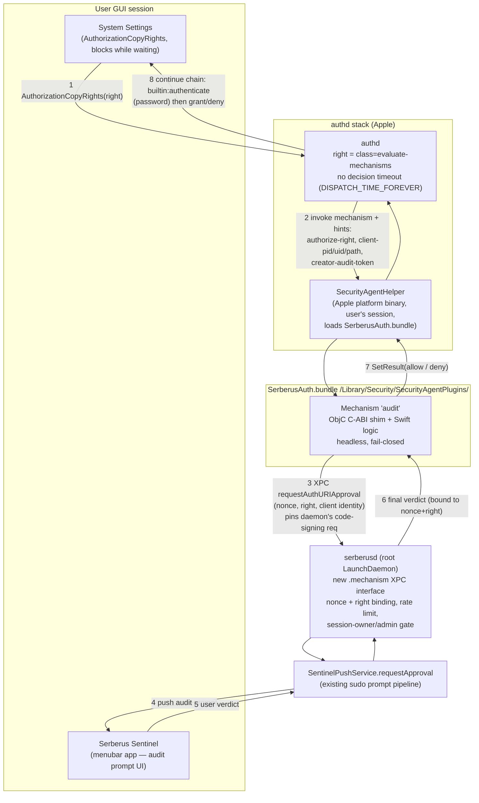

# Serberus authURI `prompt` Rules via SecurityAgent Authorization Plugin — Design

**Status: design record.** The identity mechanism is implemented in SerberusAuth but disabled in 0.9.0 (the process hints it relies on can be overwritten by the caller); the prompt mechanism described here is not built.

Today an authURI `prompt` rule still projects to the native session-owner-or-admin gate, like a silent `allow`. The plugin this design builds on does ship: `SerberusAuth.bundle` is installed by both the production package (`PKG/build-pkg.sh`) and the core test package (`PKG/build-core-test-pkg.sh`). It carries a single mechanism, `SerberusAuth:identity`, built for identity-scoped rules; in 0.9.0 those rules are disabled and the mechanism denies every request (see [authuri-identity-scoped-rules.md](authuri-identity-scoped-rules.md#disabled-in-090)). The `SerberusAuth:audit` mechanism described below would be added to the same bundle.

**Target:** macOS 26 and later, Apple Silicon. Signing follows the same-team model as the rest of Serberus: the daemon derives its team from its own code signature and trusts only callers signed by that team. Test builds use an Apple Development identity; production uses notarized Developer ID.

---

## 1. Goal & non-goals

### Goal

Make authURI rules with `elevationType=prompt` run the Serberus Sentinel audit-approval prompt **before** authd grants the right. Today, plain authURI enforcement is static AuthorizationDB rewriting (`AuthURIPolicy` and `policy(for:)` in `Sources/SerberusDaemonCore/AuthorizationDBManager.swift`): `allow` → `authenticate-session-owner-or-admin` whether the rule is silent or prompt, and `deny` → `class=deny`. The code itself documents that Sentinel-mediated authorization "would require an authorization plugin and is out of scope for V1" (the `AuthorizationDBApplier` doc comment). This design is that plugin.

Two rules of the current projection carry over unchanged. AuthorizationDB rules are applied only in `enforce` mode (`AuthorizationDBApplier.profilesToApply`); in `monitor` and `audit` the daemon reconciles every right back to its native definition. And a plain `allow` rule never opens a root-equivalent right (`rootEquivalentRightPrefixes` in `AuthRightTargetPolicy`, `Sources/PrivMgrCore/Policy/RuleSchema.swift`, which also holds the never-touch `protectedRightPrefixes`); such an allow is logged and ignored, while a `deny` on those rights still applies. A prompt rule on one of those rights must be refused for the same reason.

The mechanism: rights under a `prompt` rule are rewritten to `class=evaluate-mechanisms` referencing a Serberus SecurityAgent authorization plugin. The plugin's mechanism forwards the authorization context to `serberusd` over XPC; the daemon reuses the existing `SentinelPushService.requestApproval` pipeline (the same one the sudo/PAM path uses); the verdict flows back and the mechanism calls `SetResult(allow|deny)`. authd only grants the right if the mechanism (and the chained native password mechanisms) all allow.

### Non-goals

- **No UI inside the plugin.** The mechanism is headless; all UI is the existing Sentinel menubar app, driven by the daemon. (Mechanism hosts cannot drive the user's menubar app directly. See Apple Developer Forums [thread/819553](https://developer.apple.com/forums/thread/819553) and the authorization-plugin entry in the References.)
- **No login-path rights.** The mechanism is never attached to `system.login.console`, `authenticate*`, screensaver/unlock rights, or the `system.preferences` parent unlock. This removes the brick-the-login-window failure class entirely (NullAuthPlugin readme warning; Apple forums thread/821250).
- **No revocation of granted authorizations.** authd grants are not claw-backable; enforcement is entirely pre-grant.
- **No replacement of the sudo/PAM path.** This design covers authorization rights only.
- **V1 scope:** prompt rules on curated, recoverable System Settings rights only (e.g. `system.preferences.datetime`). Rights that aren't natively a plain admin gate, such as `system.print.admin` (gated to `lpadmin`) or `system.preferences.location` (satisfiable at the console), are out: the daemon now refuses a plain allow on them, and a prompt rule would need the same check.

---

## 2. How it works



Key facts underpinning the flow (all verified against Apple sources):

- authd waits on the mechanism **forever** (`dispatch_semaphore_wait(replyWaiter, DISPATCH_TIME_FOREVER)` in [authd agent.c](https://github.com/apple-oss-distributions/Security/blob/main/OSX/authd/agent.c)), so a 60s approval wait is architecturally fine — but nothing in the OS unsticks a hung evaluation, so the mechanism must always terminate itself (own timeout → deny).
- `SetResult` may be called "during or after returning from" `MechanismInvoke` ([AuthorizationPlugin.h](https://raw.githubusercontent.com/apple-oss-distributions/Security/main/OSX/libsecurity_authorization/lib/AuthorizationPlugin.h) lines 147-161, 298) — async completion is first-class. We fire the XPC request, return from Invoke immediately, and call SetResult from the reply handler. This keeps the host thread free to deliver `MechanismDeactivate`, which must be acked with `DidDeactivate` promptly even mid-wait.
- The right being evaluated arrives in the plugin as hint `authorize-right` ([engine.m:1779](https://github.com/apple-oss-distributions/Security/blob/main/OSX/authd/engine.m), `AGENT_HINT_AUTHORIZE_RIGHT`), so **one** mechanism serves every prompt right — the KeychainMinder pattern.
- The requesting process arrives as hints `client-pid` (int32), `client-uid` (uint32), `client-path`, `creator-pid`, and `creator-audit-token` (raw 32-byte `audit_token_t`) — set once per evaluation in `_set_process_hints`/`_set_auth_token_hints` (engine.m:236-266). Read each with the correct width; `client-pid` is 4 bytes, not 8. **They are not trustworthy:** `engine_authorize` then merges the caller's `AuthorizationCreate` / `AuthorizationCopyRights` environment into the hints (`auth_items_copy(engine->hints, environment)`), so a caller can replace any of them. This was confirmed on a real Mac (macOS 26.7). Use them for display and logging only, never to decide.

---

## 3. Plugin bundle design

**Bundle:** `SerberusAuth.bundle`, installed at `/Library/Security/SecurityAgentPlugins/SerberusAuth.bundle`. The name is load-bearing (mechanism strings reference it as `SerberusAuth:audit`) and must **never change across versions** — upgrades are atomic in-place content swaps, never renames, so a right never references an absent mechanism.

**Mechanism:** one new, non-privileged mechanism, `SerberusAuth:audit`, alongside the shipped `SerberusAuth:identity`.
- Non-privileged → hosted by SecurityAgent/SecurityAgentHelper in the console user's session (authd agent.c, bootstrap `com.apple.security.agent`). We do not need `,privileged` — the mechanism does no privileged work itself; all privileged work happens in serberusd, reached over XPC (Apple Developer Forums, [thread/819553](https://developer.apple.com/forums/thread/819553): the plugin never controls its host process even when privileged, so route through the daemon regardless).
- Mechanism ids may not contain `:` or `,` (strtok on ":," in [mechanism.c:161-198](https://github.com/apple-oss-distributions/Security/blob/main/OSX/authd/mechanism.c)); `audit` is safe. Per-right suffixing is legal but unnecessary given the `authorize-right` hint.

**Language & ABI:** Escrow-Buddy architecture, proven in production ([macadmins/escrow-buddy](https://github.com/macadmins/escrow-buddy)):
- A thin **Objective-C** file exports the C symbol `AuthorizationPluginCreate` and the 5-entry `AuthorizationPluginInterface` dispatch table (version 0: PluginDestroy, MechanismCreate, MechanismInvoke, MechanismDeactivate, MechanismDestroy) — mirror Escrow Buddy's `EBAuthPlugin.m`/`.h` ([macadmins/escrow-buddy](https://github.com/macadmins/escrow-buddy)). The shipped identity mechanism already follows this pattern in `Sources/SerberusAuth/SerberusAuthShim.m`. Pure Swift cannot export this C ABI cleanly; do not attempt it.
- All logic lives in **Swift** (mechanism class reached via bridging header), matching the rest of the repo.
- Engine callbacks arrive as `AuthorizationCallbacks` version 4; we use `GetHintValue`, `SetResult`, `DidDeactivate` only. We deliberately do **not** touch context values, so we cannot clobber `username`/context for downstream mechanisms — the failure mode Apple DTS flagged for "retro" plugins ([thread/760516](https://developer.apple.com/forums/thread/760516)).

**Bundle metadata:** plain loadable bundle (`BNDL`), empty `NSPrincipalClass`, no CFPlugIn factory wiring — discovery is purely via the exported symbol (Escrow Buddy project.pbxproj; Crypt Info.plist). **No entitlements** — entitlements apply only to a main executable, not to a plug-in (Apple Developer Forums, [thread/805295](https://developer.apple.com/forums/thread/805295)).

**What the mechanism reads (all SPI hint keys from AuthorizationTagsPriv.h — hardcoded strings, stable 10+ years, no Apple contract):**

| Hint | Type | Use |
|---|---|---|
| `authorize-right` | C string | Which right → daemon policy lookup |
| `client-uid` | uint32 | Requesting user (pre-auth; context `username` does not exist yet when we run before `builtin:authenticate`). Caller-controlled like the other process hints, so the daemon must not base a decision on it |
| `client-pid` | int32 | Prompt display + audit |
| `client-path` | C string | Prompt display (note: describes the AuthorizationRef *creator*, which can differ from client-pid's process) |
| `creator-audit-token` | 32 bytes | Logging only. It was meant to be forwarded to the daemon for identity-grade validation, but the caller can overwrite it, so it can't identify the requester |

Missing `authorize-right` (SPI drift on a future OS) → **deny** and log. Degrade closed, never guess.

**Invoke state machine (per mechanism instance):**

1. `MechanismInvoke`: read hints → generate a per-invocation nonce → fire async XPC `requestAuthURIApproval(nonce, right, clientIdentity)` → arm a local watchdog (default 65s, slightly above the Sentinel prompt timeout) → return `errAuthorizationSuccess`.
2. XPC reply → `SetResult(allow|deny)` exactly once (idempotence guard — Invoke can fire multiple times per instance per the NullAuthPlugin trace).
3. Watchdog fires / XPC error / daemon unreachable → `SetResult(deny)`.
4. `MechanismDeactivate` → cancel pending XPC, call `DidDeactivate` immediately (contract: "as soon as possible", AuthorizationPlugin.h:212-218). Instance stays alive and re-invokable (authd resets state to active after deactivate — agent.c quirk).
5. **Every code path calls SetResult.** A path that returns without it hangs the client's AuthorizationCopyRights indefinitely — there is no OS-side rescue.

**Load-success signal:** `os_log` in `AuthorizationPluginCreate`. Ignore the unified-log line "Library Validation failed… mapped file is not a platform binary" — confirmed red herring; Apple's hosts carry `com.apple.private.security.clear-library-validation` and the plugin loads anyway (Apple Developer Forums, [thread/776111](https://developer.apple.com/forums/thread/776111)). Standard users can't read the unified log, so verification goes through the Intel tab of the Sentinel window or a root-side marker.

---

## 4. Daemon changes

### 4.1 New XPC interface: `.mechanism`

`XPCInterface` (`Sources/PrivMgrCore/XPC/XPCProtocols.swift`) gains a `.mechanism` case exposing **exactly one** method:

```
requestAuthURIApproval(nonce: UUID, right: String, client: AuthURIClientIdentity, reply: (Verdict) -> Void)
```

No grant, no revoke, no policy-read. `XPCListenerService` (`Sources/SerberusDaemonCore/XPCListenerService.swift`) refuses every other method on this interface, mirroring the existing `.pam` guards. `ExpectedCaller.interface` (`XPCConnectionValidator.swift`) returns nil for any caller it doesn't name, and the listener refuses such a caller, so the `.mechanism` route must be an explicit case, exactly as `.intel` is. (When this design was written, the `default:` arm returned the most-privileged `.commander` interface; that interface has since been removed.)

### 4.2 Peer validation: a third validator, modeled on `PAMHostIdentity`

The connecting peer is **Apple's** SecurityAgentHelper, not code signed by the Serberus team. All auth plugins system-wide load into the same Apple host executables, whose signing identifiers are **not API and have changed across releases**; Apple DTS explicitly recommends skipping strict client validation on this path, justified because installing a plugin already requires root ([thread/819553](https://developer.apple.com/forums/thread/819553)).

Decision — add `MechanismHostIdentity` alongside `PAMHostIdentity` (`XPCConnectionValidator.swift`), validating from audit-token facts:

- `signatureValid && !adHocSigned`
- `isApplePlatformBinary` — satisfies `anchor apple` (NOT `anchor apple generic`, which any Developer-ID binary satisfies — same distinction the PAM validator documents)
- **No** pinned signing identifier or executable path (they are non-API and will break silently on OS updates — thread/819553)
- **No** euid keystone: the agent host runs as `_securityagent`/the user, not root, so euid==0 is not usable here the way it is for sudo

Compensating structural controls (because peer identity is inherently weak on this path):

1. The `.mechanism` interface can only *request a prompt* — worst case for an abuser is triggering a Sentinel prompt, never a grant.
2. Verdicts are bound to `(nonce, right)`; the daemon refuses to mint or reuse a verdict across nonces or rights (mirrors the sudo path's per-requestID reply binding in `SentinelPushService.swift`).
3. Per-UID rate limiting + prompt coalescing (identical right+client within N seconds → one prompt) to blunt approval-fatigue spam; the existing caps in `SentinelPushService` (8 unresolved prompts per user, 64 per daemon) limit concurrency, not rate.
4. Prompt display fields are sourced from the hints authd stamped (client-path/pid/uid), never from free-form plugin strings. These hints can be overwritten by the caller (see §2), so the prompt must not present them as verified facts about the requester.

### 4.3 Reverse direction — the strong pin

The plugin validates the daemon, which we *do* control: apply the code-signing requirement **directly to the XPC connection** (`xpc_connection_set_peer_code_signing_requirement`, per Apple's guidance in thread/819553 — not manual `SecCodeCheckValidity`), pinning the daemon's identifier (`com.herojoneslabs.serberus.daemon`) and the plugin's own team, read from the plugin's own signature the same way `BundleConfig` does for the daemon (so the test and production builds each pin their own team, with nothing hardcoded), plus the privileged-Mach-service flag so only the root daemon can answer.

### 4.4 Policy enforcement moves into the daemon

`class=user` semantics (`group=admin`, `session-owner`) do **not** survive conversion to evaluate-mechanisms — `builtin:authenticate` verifies a password but enforces no group membership (on macOS 26.5.1, evaluate-mechanisms rules carry no group/session-owner keys). The daemon must therefore re-impose the who-is-allowed gate on `requestAuthURIApproval` using `client-uid`: verify the requesting uid is the console session owner (and any additional policy conditions), *then* run the Sentinel prompt. Deny outright if the gate fails — no prompt.

### 4.5 Verdict finality

authd's grant happens after `SetResult(allow)` and is not revocable, so the daemon's sudo-path safeguard of holding approval until the timed grant persists (`SentinelPushService.swift`) has no analogue. The daemon returns only **final** verdicts; the plugin calls SetResult only on that final verdict. No optimistic allow, no reconcile-later.

### 4.6 Projection & diffing changes in `AuthorizationDBManager`

- `AuthURIPolicy` gains a `.sentinelPrompt` case producing the evaluate-mechanisms definition (§5), slotted into the existing projection/`DesiredRight` machinery.
- **Diffing prerequisite (done):** `semanticallyEqual`/`policyFields` used to compare only `class`/`rule`/`group`, so two definitions with different mechanism arrays compared equal and `apply()` skipped needed rewrites. `policyFields` now also compares `mechanisms`, `shared` and `timeout`, plus `k-of-n`, `requirement` and the `class=user` principal flags used by identity-scoped compositions.
- Prompt-eligibility check: `elevationType=prompt` may only attach to rights that pass `isProtected`, are not root-equivalent (`isRootEquivalent`), **and** pass a new prompt-specific exclusion for the exact right `system.preferences` (the global pane unlock is absent from `protectedRightPrefixes` — a wedged mechanism there would block the very pane an admin needs for recovery). Note the exclusion must be exact-match, not the prefix `system.preferences.`, or every child right Serberus manages goes off-limits.
- Snapshot/restore already structurally covers evaluate-mechanisms — `restoreAll()` rewrites the whole original blob, and an unreadable snapshot falls back to the verified native-default row, then Apple's shipped definition, then the admin-gate stand-in (`.requireAdmin`), never deny. Verify the pkg preserves `authDBBackupDirectory` across upgrades (silent fidelity regression otherwise).

### 4.7 Plugin liveness

serberusd cannot see a fault inside SecurityAgentHelper (`DaemonHealthProbe` checks only the daemon's own subsystems). Add: the plugin pings the daemon on every load (`AuthorizationPluginCreate`) and per-invocation; the daemon exposes a `pluginLastSeen` health fact and flags degraded when prompt rights are deployed but the plugin has never checked in. The mechanism's own short watchdog converts a daemon stall into a fast deny rather than an indefinite authd hang.

---

## 5. Right-definition composition

Exact definition written for each `elevationType=prompt` right (shape verified against the live macOS 26.5.1 authdb — the `authenticate` rule itself is class=evaluate-mechanisms with this key set):

```xml
<dict>
    <key>class</key>          <string>evaluate-mechanisms</string>
    <key>mechanisms</key>
    <array>
        <string>SerberusAuth:audit</string>
        <string>builtin:authenticate</string>
        <string>builtin:authenticate,privileged</string>
    </array>
    <key>shared</key>         <false/>
    <key>timeout</key>        <integer>0</integer>
    <key>tries</key>          <integer>3</integer>
    <key>comment</key>        <string>Serberus authURI prompt rule</string>
    <key>version</key>        <integer>1</integer>
</dict>
```

**Password chaining decision: KEEP native password auth, Serberus first.** Rationale:

1. **Audit-before-credentials.** Serberus runs first so a denied audit never collects a password, and the user isn't asked to authenticate for something that will be refused. It also means we identify the requester from hint `client-uid` (context `username` doesn't exist yet — it's populated by `builtin:authenticate`, which hasn't run).
2. **Serberus is never the sole arbiter.** `builtin:authenticate` + `builtin:authenticate,privileged` (the exact pair Apple's own `authenticate` rule uses — collect/UI in the agent, verify as root in authhost) still require the user's password after approval. Approval-fatigue or a verdict bug alone cannot grant the right.
3. **Graceful step-aside.** Under an explicit kill-switch/uninstall signal from the daemon, the mechanism can return `allow` — degrading the right to native password auth via the remaining chain — instead of bricking it, while the daemon's existing `reconcile([])` restore (`DaemonController.swift`) rewrites the static definition. (The alternative, `kAuthorizationResultUndefined` fallthrough, has uncertain semantics — Open Question 4.)
4. **Parity with the current `.prompt` UX**, which already ends in a native password sheet; we are inserting the audit gate in front, not replacing authentication.

`shared=false, timeout=0` is mandatory: with shared credentials or a nonzero timeout, authd satisfies repeat evaluations from cache and **the mechanism chain is not re-run** — the second datetime change inside the window would bypass Sentinel entirely. (On macOS 26.5.1 the `system.preferences` parent is `shared=true, timeout=2147483647` — another reason prompt rights must be scoped to leaf rights, not the parent.)

Caveat carried to Open Questions: no known third party has shipped evaluate-mechanisms on a *System Settings preference right* — every open-source precedent (Crypt, XCreds, Escrow Buddy, Jamf Connect) gates `system.login.console`. Mechanically permitted, but unproven.

---

## 6. Failure & recovery semantics

Every row states the fail direction explicitly.

| Failure | Behavior | Fail direction |
|---|---|---|
| serberusd unreachable / XPC error | Mechanism `SetResult(deny)` immediately. The daemon's fail-closed (`SentinelPushService.requestApproval` denies with no Sentinel connected) is *its* behavior; the mechanism implements its own, independently. | **Closed** |
| No Sentinel connected for the user | Daemon returns deny (existing behavior). | **Closed** |
| Prompt timeout (user ignores) | Sentinel-side timeout → deny; mechanism watchdog (65s) is the backstop → deny. | **Closed** |
| Mechanism watchdog fires (daemon accepted request, never replied) | `SetResult(deny)`. Never rely on authd — it waits forever. | **Closed** |
| Plugin bundle missing but right still references `SerberusAuth:audit` | authd cannot run the mechanism; evaluation fails → right denied. This state is **prohibited by construction** via install/uninstall ordering (§8) but its direction, if reached, is closed. Exact authd behavior is Open Question 8. | **Closed** |
| Plugin wedged (loads, never answers) | Client blocks until mechanism watchdog denies. Liveness probe (4.7) drives daemon-degraded + operator alert. | **Closed** (bounded by watchdog) |
| Kill switch | Daemon `reconcile([])` restores every right to its snapshotted native definition (the kill-switch path in `DaemonController.swift`). During the restore window, a mechanism invocation that receives the daemon's explicit kill-switch status returns **allow**, degrading to the native password chain still present in the definition — "IT disabled Serberus" must not become "IT bricked this pane". Restore is best-effort (`restoreAll()`); a failed restore leaves the right on the chain, which still works password-only via step-aside. | **Open to native auth** (deliberate, only on explicit kill-switch status — never on mere unreachability) |
| Uninstall | Ordering (enforced, not best-effort): (1) restore authdb with `--restore-authdb`, which fails while any right still references SerberusAuth; (2) delete the plugin bundle only if the restore succeeded, `authdb-backups` holds no pending `.json` / `.branches` / `.projection` record, **and** a read-only query of the live auth.db finds no Serberus composition row invoking SerberusAuth and no right delegating to one (never a comment, which anyone can copy); (3) delete the daemon binary **last** (`--restore-authdb` needs it). The shipped uninstallers already work this way. | Closed until restore succeeds; native after |
| Upgrade | Bundle name + mechanism id stable forever; content swap atomic (write-temp + rename, never overwrite the Mach-O in place — Apple "Updating Mac Software" guidance via thread/821250). Hosts cache loaded plugins: `killall SecurityAgent authorizationhost` post-upgrade (hosts are transient; next evaluation maps the new bundle). No authdb repoint needed. | N/A (no dangling-reference window) |
| macOS update | softwareupdate resets the authdb to `/System/Library/Security/authorization.plist` defaults ([elliotjordan.com/posts/macos-authdb-mechs](https://www.elliotjordan.com/posts/macos-authdb-mechs)). Rights revert to native (open-to-native, not closed). Daemon re-applies desired state on next startup reconcile; add an explicit post-update re-apply check. | **Open to native** until reconcile runs |
| Corrupt snapshot at restore | Falls back to the verified native-default row, then Apple's shipped definition, then `.requireAdmin`; never deny (`restoreAll()`). | Native, else open to admin-auth |

---

## 7. Security analysis

Top risks from the red-team pass, each with its mitigation in this design:

1. **Fail-open = catastrophic.** A mechanism returning allow when serberusd is unreachable bypasses every prompt right at once. → Mechanism fails closed on unreachability/timeout/error; the *only* allow-without-verdict path is an explicit, daemon-asserted kill-switch status (§6), and even that degrades to native password auth because the password mechanisms remain in the chain.
2. **Weak peer identity on the mechanism→daemon XPC path.** The peer is Apple's shared plugin host; the daemon cannot cryptographically distinguish the Serberus plugin from any other code in that host, and host identifiers are non-API (thread/819553). → Accept Apple-platform-binary peers on a dedicated `.mechanism` interface whose *only* power is requesting a prompt; bind verdicts to (nonce, right); rate-limit and coalesce prompts; source prompt display from authd hints. Harden the direction we *can*: plugin pins the daemon's signing requirement on the connection + privileged flag.
3. **Interface fallthrough.** When this design was written, any unrecognized caller inherited the most-privileged interface (`ExpectedCaller.interface` in `XPCConnectionValidator.swift`). That is fixed: an unnamed caller now gets no interface and is refused. → Explicit `.mechanism` case; listener refuses non-interface methods.
4. **Mechanism-diff blindness.** If `policyFields` ignored `mechanisms`, upgrades repointing a mechanism would become silent no-ops. → `policyFields` now compares `mechanisms`, `shared` and `timeout` (implementation step 1, done).
5. **Silent privilege widening on conversion.** evaluate-mechanisms drops `group=admin`/session-owner enforcement. → Daemon re-imposes the gate from `client-uid` before prompting (4.4).
6. **Credential-cache bypass.** `shared=true`/`timeout>0` skips the mechanism on repeat grants. → `shared=false, timeout=0` mandatory in the projection; enforced by test.
7. **Brick radius.** Wedged mechanism on a recovery-critical right. → Never attach to login/unlock rights or the `system.preferences` parent; prompt-eligibility allowlist + expanded protection (4.6); SSH + `serberusd --restore-authdb` remains the manual escape hatch.
8. **TOCTOU / verdict reuse.** No claw-back after SetResult(allow). → Final-verdict-only protocol, nonce+right binding, no verdict caching in the daemon.
9. **Approval-fatigue spam.** Anything that can drive authorizations can drive prompts. → Rate limiting + coalescing (4.2); password chain means fatigue alone still can't grant.
10. **Prompt spoofing.** Plugin-supplied strings could mislead the approver. → Display fields come exclusively from authd-stamped hints.

---

## 8. Install / packaging

**Test builds:** the core test package signs `SerberusAuth.bundle` with an Apple Development identity from your team, no entitlements, no notarization — sufficient for development (Apple Developer Forums, thread/805295). Library validation is satisfied by Apple's host entitlement, nothing on our side (thread/776111). **Build and sign outside any folder a file-sync service manages**: the extended attributes such services add to files invalidate code signatures.

**Production:** the production package (`PKG/build-pkg.sh`) ships the same bundle, signed Developer ID Application, `--timestamp`, `CODE_SIGN_INJECT_BASE_ENTITLEMENTS=NO`, notarized — the recipe Escrow Buddy uses (its `project.pbxproj` and `build_and_pkg.sh`, in [macadmins/escrow-buddy](https://github.com/macadmins/escrow-buddy)).

**Packaging.** Already in place for the shipped bundle (the core test package, `PKG/build-core-test-pkg.sh`, is the reference; the production package installs the same bundle to the same path):
- Payload: `SerberusAuth.bundle` → `/Library/Security/SecurityAgentPlugins/` (root-owned; `sudo cp -R` semantics give correct perms — thread/805295).
- Postinstall: best-effort `killall SecurityAgent authorizationhost` so the next evaluation maps the fresh bundle (hosts are transient, per-evaluation); daemon reconcile then writes/refreshes the right definitions (`security authorizationdb` changes apply immediately, no reboot).
- Uninstall removes the bundle only after a successful AuthorizationDB restore that leaves no right referencing it, and kills the hosts afterwards.
- The bundle filename and mechanism ids are frozen: rights in auth.db reference `SerberusAuth:<mechanism>` by name.

Still needed for the prompt path:
- Preinstall/payload must **not** clean `authDBBackupDirectory` (snapshot fidelity, 4.6).

**Dev-iteration note:** hosts cache loaded plugin code; after every rebuild, kill the hosts (or log out/in) before re-testing, and use move-old-then-copy-new, never in-place overwrite (thread/821250).

---

## 9. Open questions

The `SerberusAuthProbe` spike (`extras/SerberusAuthProbe/authprobe-spike.sh`) and the shipped identity mechanism have answered questions 1 and 5. The rest are specific to a prompt mechanism on System Settings rights and remain open.

1. **Does an Apple-Development-signed bundle load into SecurityAgentHelper?** *Answered: yes.* The core test package ships `SerberusAuth.bundle` signed with an Apple Development identity, and the identity mechanism runs from it; the load is logged from `AuthorizationPluginCreate`.
2. **Does evaluate-mechanisms work on a System Settings preference right?** Zero shipped precedent (all OSS gates `system.login.console`). Confirm System Settings' Admin-framework caller actually drives the mechanism for e.g. `system.preferences.datetime`, and what its UI does during a 60s mechanism hold (undocumented everywhere).
3. **Does `SetResult(deny)` behave sanely from a chained mechanism on a prefs right?** No open-source project ever calls deny — both Escrow Buddy and Crypt only allow. Verify the client gets `errAuthorizationDenied`, Settings shows a reasonable failure, and no retry loop re-invokes indefinitely (`tries` interaction).
4. **`kAuthorizationResultUndefined` semantics in an ordered chain** — header says "operation failed, do not retry this session"; does it deny or fall through? Determines whether kill-switch step-aside uses `allow` (current decision) or `Undefined`.
5. **Hint availability on current macOS.** *Answered: yes.* All hint keys are SPI (AuthorizationTagsPriv.h), verified against the latest *published* Security source. The probe confirmed the hints arrive. The identity mechanism relied on `authorize-right`, `client-pid` and `creator-audit-token`; the process hints turned out to be caller-controlled, which is why that mechanism is disabled in 0.9.0.
6. **Peer facts of SecurityAgentHelper on 26** for `MechanismHostIdentity`: platform-binary flag, euid, signing identifier (captured for logging only, never pinned).
7. **A focus-steal regression in macOS 26.1:** invoking any mechanism yanks window focus even with no UI ([thread/807112](https://developer.apple.com/forums/thread/807112)). Measure impact on the prompt UX on the exact macOS build under test.
8. **What exactly happens when the right references a mechanism whose bundle is absent** (deny? hang? error) — informs whether the by-construction ordering guarantee needs a runtime backstop.
9. **`builtin:authenticate` UX when chained after our mechanism on a prefs right:** which user does it collect (session owner vs. admin-picker), given the group gate is gone? Determines whether the daemon-side gate (4.4) alone matches today's `authenticate-session-owner-or-admin` semantics.
10. **Post-OS-update re-apply latency:** confirm daemon startup reconcile actually restores prompt rights after a softwareupdate authdb reset, and how long the native-auth window is.

---

## 10. Implementation plan (small steps, each independently testable)

1. **`policyFields` fix (pure Swift, no plugin).** *Done.* `policyFields`/`semanticallyEqual` cover `mechanisms`/`shared`/`timeout`; unit tests prove mechanism-array changes are detected and metadata churn still isn't.
2. **Spike bundle ("SerberusAuthProbe").** Throwaway ObjC+Swift logging mechanism, manually attached to one low-risk right on a test Mac. Targets Open Questions 1–9 (load, hints, deny, Undefined, Settings UX during hold, focus steal, absent-bundle behavior, chained-authenticate UX). No daemon involvement. *Built* (`extras/SerberusAuthProbe/authprobe-spike.sh`); see §9 for what it has answered. Everything after this step depends on its results.
3. **Real plugin skeleton, fail-closed stub.** `SerberusAuth.bundle` (it now exists, carrying the identity mechanism) gains an `audit` mechanism with the full Invoke/Deactivate state machine but a stubbed verdict source that always denies after logging. Testable by attaching to a scratch right: proves lifecycle, watchdog, idempotent SetResult, DidDeactivate under cancellation.
4. **Daemon: `.mechanism` interface + `MechanismHostIdentity` validator.** New XPC case, listener guards, Apple-platform-binary validation, decision-table unit tests (mirroring the PAMHostIdentity test pattern). No caller yet; exercised by tests only.
5. **Daemon: `requestAuthURIApproval` → SentinelPushService bridge.** Nonce+right verdict binding, session-owner/admin gate from client-uid, rate limiting/coalescing, kill-switch status in the reply. Unit-testable against a fake Sentinel connection.
6. **Wire plugin → daemon.** XPC client in the plugin with the pinned daemon code-signing requirement + privileged flag; end-to-end on the test Mac: Settings → Sentinel prompt → approve/deny → grant/fail. First full-path milestone.
7. **Projection: `AuthURIPolicy.sentinelPrompt`.** Exact plist of §5, prompt-eligibility allowlist (+ `system.preferences` exact-match exclusion), reconcile/snapshot/restore round-trip tests against a fake backend.
8. **Packaging + lifecycle.** Pkg payload, postinstall host-kill, uninstall restore-success gate + ordering, upgrade atomic swap, backup-dir preservation check. Testable by install/upgrade/uninstall cycles on a test Mac.
9. **Liveness + operations.** Plugin heartbeat, `pluginLastSeen` health fact, degraded-mode alert, post-OS-update re-apply verification, diagnostics for the new path in the Sentinel window's Intel tab.
10. **Live validation pass on a dedicated, MDM-enrolled test Mac:** full matrix — approve, deny, timeout, daemon-stopped, kill-switch, uninstall, upgrade, OS-update reset — before any production-signing work.

---

### References

Apple source:

- [AuthorizationPlugin.h](https://raw.githubusercontent.com/apple-oss-distributions/Security/main/OSX/libsecurity_authorization/lib/AuthorizationPlugin.h)
- [authd engine.m](https://github.com/apple-oss-distributions/Security/blob/main/OSX/authd/engine.m), [agent.c](https://github.com/apple-oss-distributions/Security/blob/main/OSX/authd/agent.c), [mechanism.c](https://github.com/apple-oss-distributions/Security/blob/main/OSX/authd/mechanism.c), and AuthorizationTagsPriv.h in the same repo

Apple Developer Forums threads: [749754](https://developer.apple.com/forums/thread/749754), [776111](https://developer.apple.com/forums/thread/776111), [776289](https://developer.apple.com/forums/thread/776289), [805295](https://developer.apple.com/forums/thread/805295), [807112](https://developer.apple.com/forums/thread/807112), [819553](https://developer.apple.com/forums/thread/819553), [821250](https://developer.apple.com/forums/thread/821250), [760516](https://developer.apple.com/forums/thread/760516).

Other authorization plugins and write-ups:

- [macadmins/escrow-buddy](https://github.com/macadmins/escrow-buddy)
- [grahamgilbert/crypt](https://github.com/grahamgilbert/crypt)
- [google/macops-keychainminder](https://github.com/google/macops-keychainminder)
- [elliotjordan.com/posts/macos-authdb-mechs](https://www.elliotjordan.com/posts/macos-authdb-mechs)
- Csaba Fitzl, "Beyond the good ol' LaunchAgents", part 28 (authorization plugins)

Right definitions quoted in this document were read from macOS 26.5.1 (25F80).

Code: `Sources/SerberusDaemonCore/AuthorizationDBManager.swift`, `Sources/PrivMgrCore/XPC/XPCConnectionValidator.swift`, `Sources/SerberusDaemonCore/SentinelPushService.swift`, `Sources/SerberusDaemonCore/DaemonController.swift`, `Sources/SerberusAuth/`, `PKG/Scripts/uninstall.sh`.
